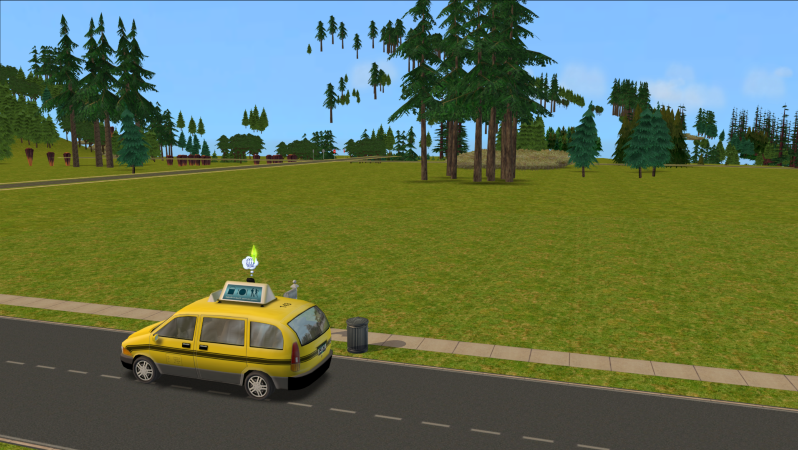
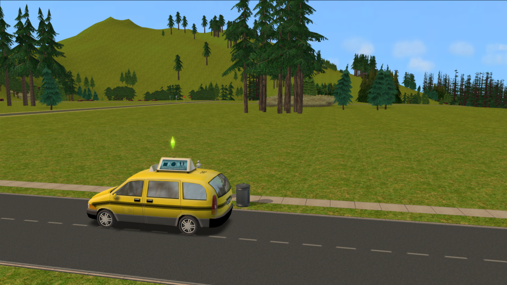

# TS2 Mini Mods
## About
A collection of small patches for The Sims 2 that fix or improve various minor issues/annoyances.

Made for use with The Sims 2: Ultimate Collection, using either [Sims2RPC](https://modthesims.info/d/648220/sims2rpc-modded-sims-2-launcher-for-mansion-and-garden.html)
or [Ultimate ASI Loader](https://github.com/ThirteenAG/Ultimate-ASI-Loader).

## Available Plugins
### TS2CineDrawDistance
The terrain draw distance during cinematics is severely limited, regardless of whatever graphics options the player has set &mdash; this plugin simply multiplies
the depth offset of the camera clip plane by 4 when a cinematic is playing.

| Vanilla | Mod |
| :-----: | :-: |
|  |  |

### TS2MovieSkipper
Patches out the intro movies that play when the game first launches, taking the player straight to the initial loading screen. Inspired by a feature from
[TS2 Extender](https://github.com/LazyDuchess/TS2-Extender).

## Installation
**For Sims2RPC**

1. Download one or more of the plugins found under the [Releases](https://github.com/spockthewok/TS2MiniMods/releases/latest) section of this repository.
2. Move the downloaded plugins to the `\TSBin\mods` directory, found under wherever you have the Sims 2 installed to. For example, on my machine, they would be moved to:

   `E:\Games\The Sims 2\Fun with Pets\SP9\TSBin\mods`

**For Ultimate ASI Loader**

1. Download Ultimate ASI Loader from [here](https://github.com/ThirteenAG/Ultimate-ASI-Loader/releases/download/Win32-latest/dsound-Win32.zip).
2. Extract `dsound.dll` from the zip file and place it in the game's `\TSBin` directory. On my machine, it would go here:

   `E:\Games\The Sims 2\Fun with Pets\SP9\TSBin`
3. Download one or more of my [plugins](https://github.com/spockthewok/TS2MiniMods/releases/latest) and move them to the same `\TSBin` directory Ultimate ASI Loader
was extracted to.

## Thanks
[LazyDuchess](https://github.com/LazyDuchess), for the hooking code used in this mod, and for [TS2 Extender](https://github.com/LazyDuchess/TS2-Extender).